# 
# SADSA – Automated Agricultural Subsidy Request System

## Project Overview
  
  
  
- **Field Visit Geolocation:** Integrates GPS capture and photographic documentation for field inspections.
- **Real-Time Tracking:** Provides real-time status and history for all subsidy requests.
  
  
  

### Common Interfaces
  
  
  
  
### Phase 1: Antenna Agent
- **Project Type Selection:**
  
  
  
  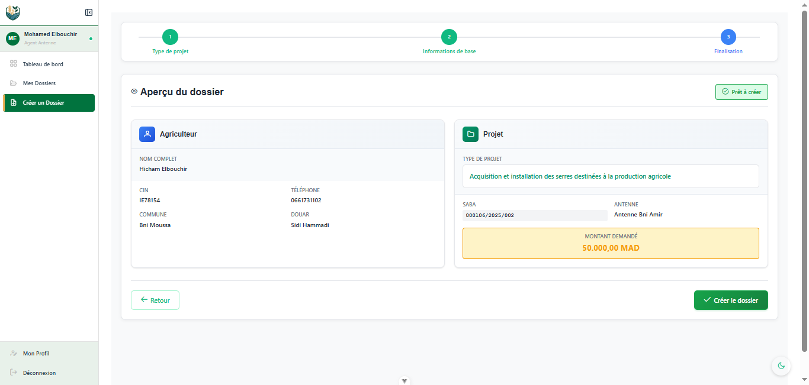
- **Receipt Generation:**
  
  
- **Dossier Details:**
  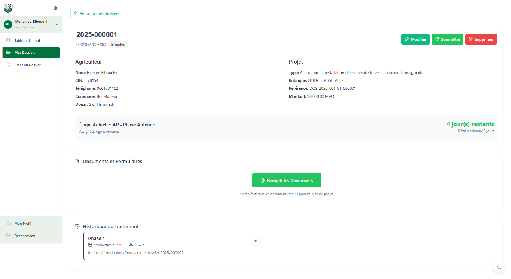
  
  
  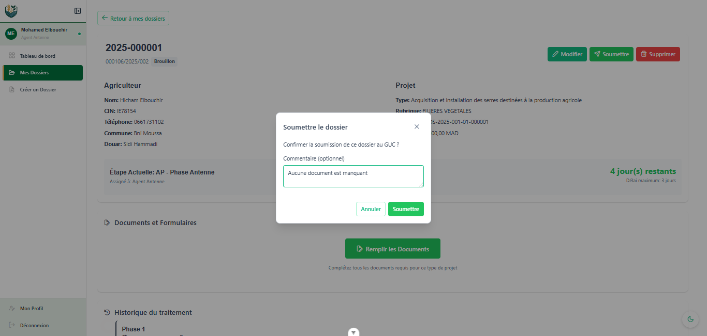

  
  
  
  
  
  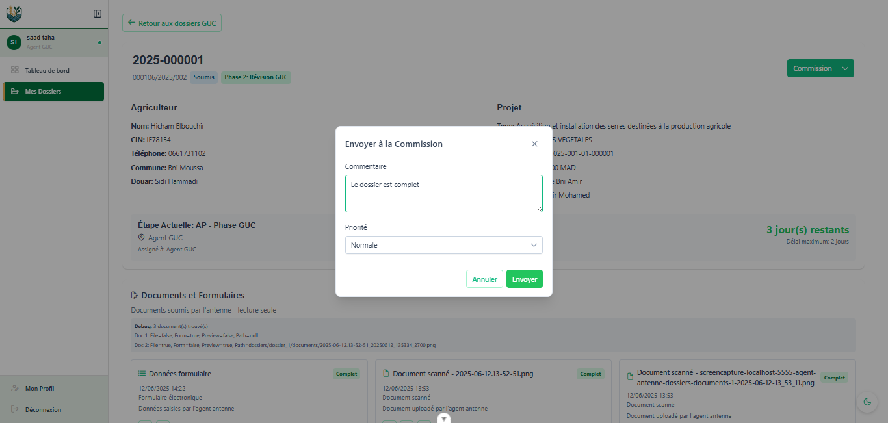

  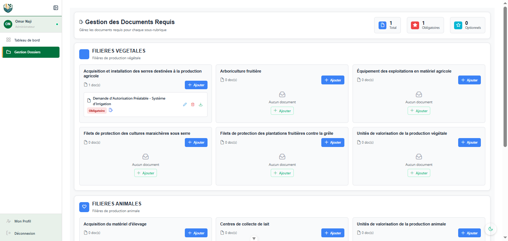
  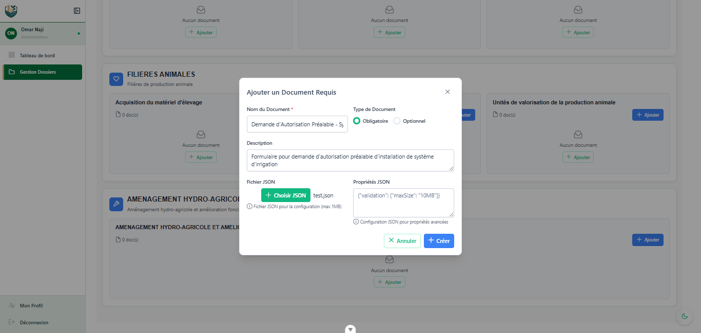
  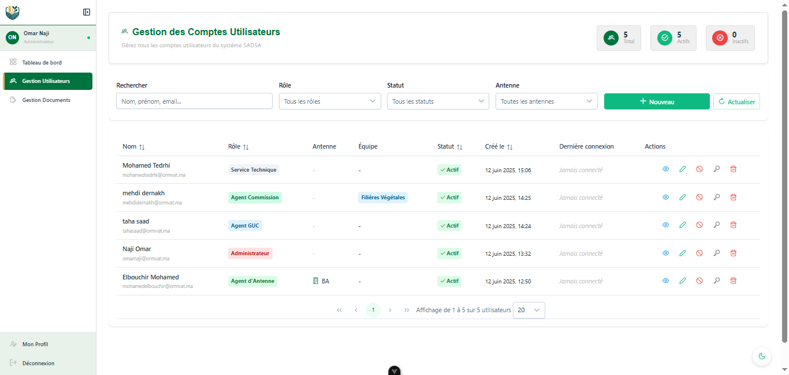
  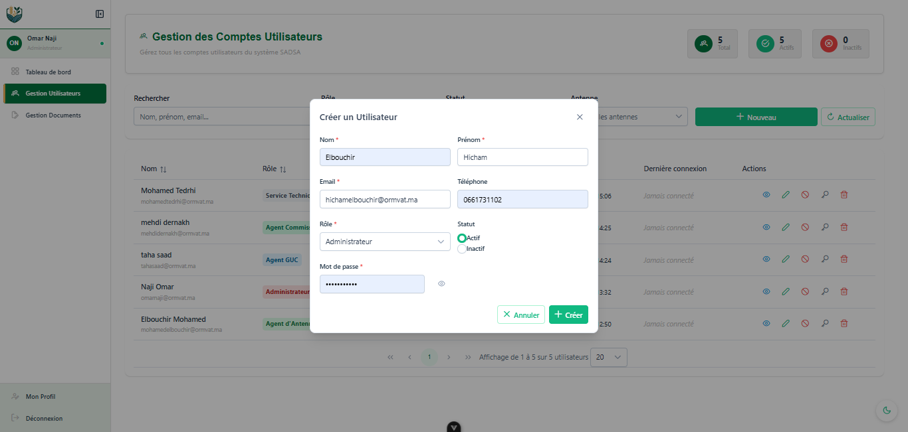
  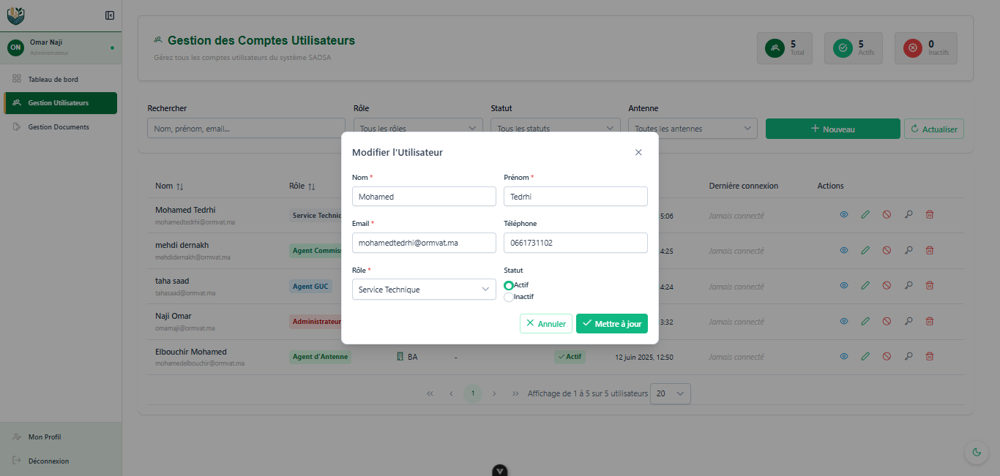
  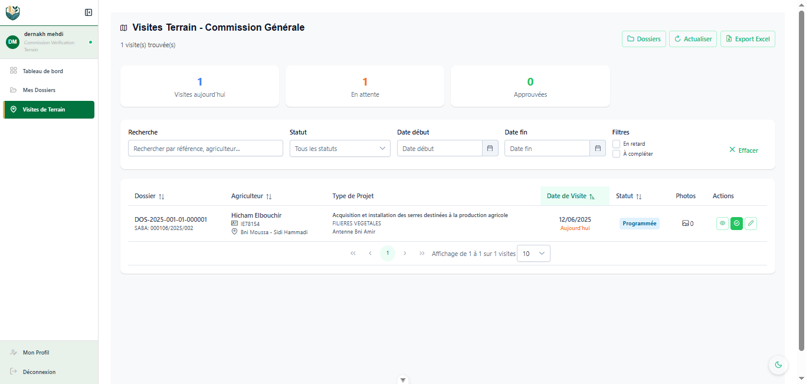
- **Finalize Visit:**
  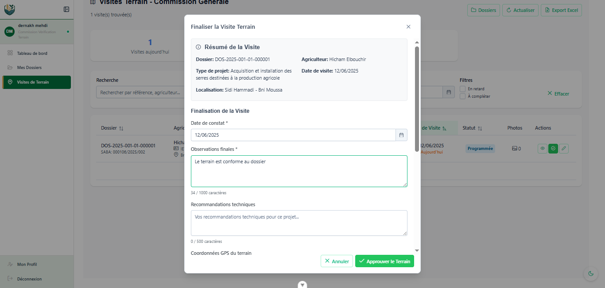

### Phase 4: GUC Final Approval
  
  
  
  
  
  
  
  
  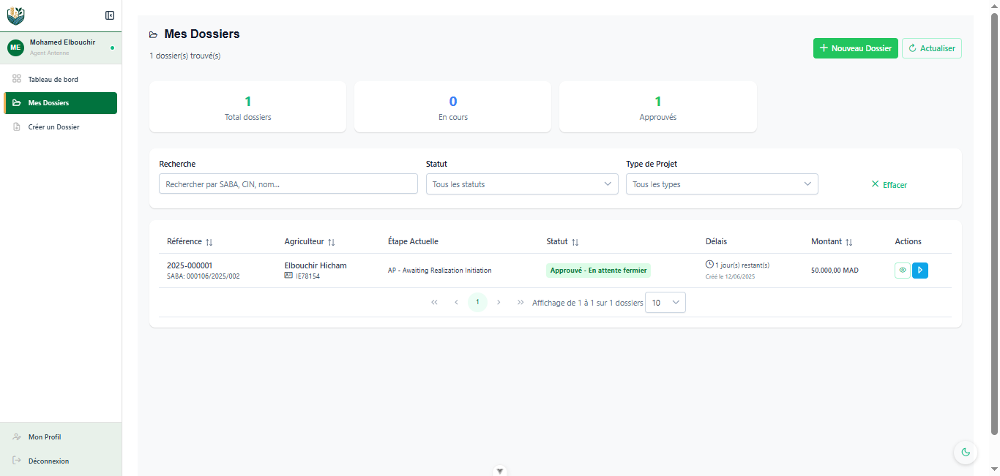
- **Start Realization:**
  
  
  
  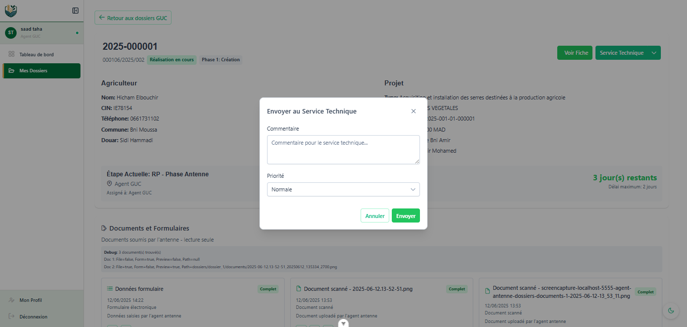
- **Service List:**
  
  
  
  
- **Schedule Technical Visit:**
  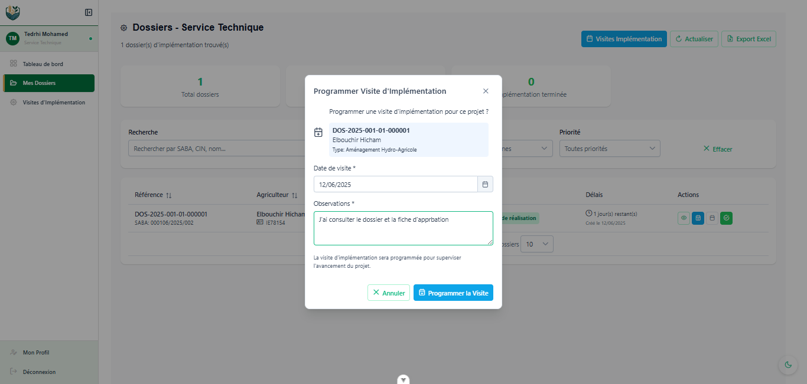
  
  
  
- **Finalize Visit:**
  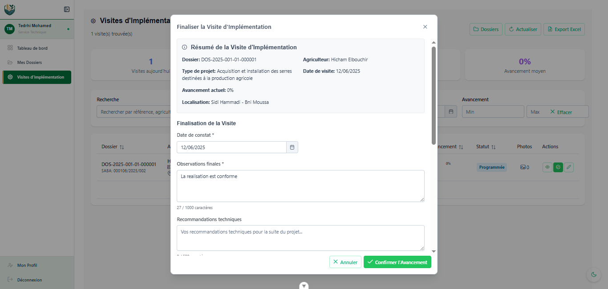
  
  
  
- **Add Required Document:**
  
  
- **Add User:**
  
  
  
  
  
  
- **Backend:** Java (Spring Boot, Spring Data JPA, Spring Security)
- **Frontend:** Vue.js (SPA) with PrimeVue UI components
- **Database:** MySQL (designed and managed with MySQL Workbench)
- **Authentication:** JWT (JSON Web Token) for stateless, secure API access
- **Development Tools:**
  - Visual Studio Code (IDE)
  - Astah UML (UML modeling)
  - Postman (API testing)
  - Inkscape (vector graphics)
  - Git & GitHub (version control)

### Main Entities
- **Dossier:** Central entity for subsidy requests, tracking status, applicant, and workflow history
- **Utilisateur:** System users with roles (Admin, Antenna Agent, GUC Agent, Commission, Technical Service)
- **Agriculteur:** Beneficiary farmers with personal and location data
- **VisiteTerrain / VisiteImplementation:** Field and implementation visits with geolocation and reports
- **PieceJointe:** Attached documents for each dossier

### Setup & Installation

1. **Clone the repository:**
   ```bash
   git clone https://github.com/migi-gluttony/sadsa-ormvat.git
   ```
2. **Backend:**
   - Navigate to `backend/`
   - Configure `application.properties` for your MySQL instance
   - Build and run with Maven:
     ```bash
     ./mvnw spring-boot:run
     ```
3. **Frontend:**
   - Navigate to `frontend/`
   - Install dependencies:
     ```bash
     npm install
     ```
   - Start the development server:
     ```bash
     npm run dev
     ```

## License

This project is licensed under the MIT License.

---

*For more details, see the full project report and code documentation.*
